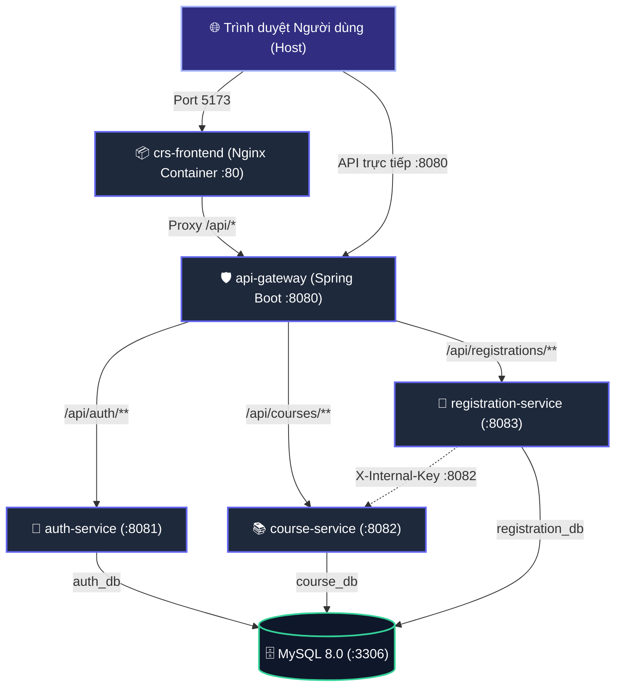

# BUỔI 10: TÍCH HỢP TOÀN HỆ THỐNG MICROSERVICES & HƯỚNG DẪN TỰ HỌC DOCKER COMPOSE

Tài liệu này cung cấp hướng dẫn thực hành và tự học toàn diện về Docker, Dockerfile và Docker Compose cho hệ thống **Course Registration System (CRS Microservices)**.

---

## 1. Kiến trúc Hệ thống & Sơ đồ Điều phối Docker

Hệ thống được thiết kế theo kiến trúc **Microservices với Database-per-Service**, bao gồm 5 dịch vụ độc lập kết nối qua mạng nội bộ Docker (`crs-network`):



### Bảng tổng hợp Port & Vai trò các Container:

| Container Name | Service | Image / Base | Cổng Container | Cổng Host (Máy bạn) | Vai trò chính |
|---|---|---|---|---|---|
| `crs-frontend` | Frontend SPA | `nginx:alpine` | 80 | **5173** | Giao diện React + Nginx reverse proxy |
| `crs-api-gateway` | API Gateway | `eclipse-temurin:21-jre-alpine` | 8080 | **8080** | Định tuyến, xác thực JWT, bảo vệ hệ thống |
| `crs-auth-service` | Auth Service | `eclipse-temurin:21-jre-alpine` | 8081 | **8081** | Đăng ký, đăng nhập, cấp JWT, quản lý tài khoản |
| `crs-course-service` | Course Service | `eclipse-temurin:21-jre-alpine` | 8082 | **8082** | Quản lý môn học, giữ chỗ/trả chỗ nội bộ |
| `crs-registration-service` | Registration | `eclipse-temurin:21-jre-alpine` | 8083 | **8083** | Đăng ký học phần, gọi liên service |
| `crs-mysql` | Database | `mysql:8.0` | 3306 | **3306** | Lưu trữ 3 CSDL: `auth_db`, `course_db`, `registration_db` |

---

## 2. Giải thích Chi tiết Kỹ thuật Dockerfile (Multi-Stage Build)

Tất cả các dịch vụ backend đều sử dụng kỹ thuật **Multi-Stage Build** (xây dựng nhiều giai đoạn).

### Tại sao cần Multi-Stage Build?
- **Cách thông thường (1 stage):** Cần cả Maven và JDK trong image cuối cùng ➔ Dung lượng image lên tới **800MB - 1.2GB**, chứa nhiều công cụ thừa thãi dễ bị tấn công bảo mật.
- **Multi-stage (2 stages):**
  - **Stage 1 (Builder):** Sử dụng `maven:...-alpine` để biên dịch code ra file `.jar`.
  - **Stage 2 (Runtime):** Chỉ sao chép file `.jar` sang một image JRE siêu nhỏ (`eclipse-temurin:21-jre-alpine`) ➔ Dung lượng giảm xuống chỉ còn **~200MB**, không chứa mã nguồn, an toàn và khởi động nhanh.

### Mẫu Dockerfile chuẩn của Spring Boot Backend:
```dockerfile
# Stage 1: Build JAR
FROM maven:3.9.9-eclipse-temurin-21-alpine AS builder
WORKDIR /build

# Tận dụng cơ chế Docker layer cache: Chỉ tải lại dependency khi pom.xml thay đổi
COPY pom.xml .
RUN mvn dependency:go-offline -B

# Copy mã nguồn và đóng gói bỏ qua unit test khi build container
COPY src ./src
RUN mvn clean package -DskipTests -B

# Stage 2: Runtime Image gọn nhẹ
FROM eclipse-temurin:21-jre-alpine
WORKDIR /app

# Tạo tài khoản non-root để tăng độ bảo mật (ngăn container breakout)
RUN addgroup -S spring && adduser -S spring -G spring
USER spring:spring

COPY --from=builder /build/target/*.jar app.jar

ENV TZ=Asia/Ho_Chi_Minh
EXPOSE 8080

ENTRYPOINT ["java", "-XX:+UseContainerSupport", "-XX:MaxRAMPercentage=75.0", "-jar", "app.jar"]
```

### Dockerfile của Frontend (`crs-frontend`):
- Sử dụng Node 22 để build Vite production bundle (`/dist`).
- Sử dụng Nginx để phục vụ static files và chuyển hướng (reverse proxy) các request `/api/` về container `api-gateway:8080`, tránh hoàn toàn lỗi CORS.

---

## 3. Giải thích File `docker-compose.yml`

File `docker-compose.yml` định nghĩa toàn bộ hạ tầng chỉ trong 1 văn bản:

1. **`healthcheck` trên MySQL:**
   ```yaml
   healthcheck:
     test: ["CMD", "mysqladmin", "ping", "-h", "localhost", "-u", "student", "-pstudent"]
     interval: 5s
     timeout: 5s
     retries: 10
     start_period: 15s
   ```
   > **Ý nghĩa:** MySQL mất từ 10-15s để khởi tạo. Spring Boot nếu kết nối ngay sẽ bị văng lỗi `Communications link failure`. Healthcheck đảm bảo MySQL đã sẵn sàng 100% trước khi cho phép các backend khởi động (`condition: service_healthy`).

2. **Cơ chế Khởi tạo 3 CSDL tự động (`init.sql`):**
   - File [`docker/mysql/init.sql`](file:///c:/Users/ADMIN/Downloads/course-microservices/docker/mysql/init.sql) được mount vào `/docker-entrypoint-initdb.d/` của container MySQL.
   - MySQL sẽ tự động chạy file này ngay lần đầu tiên container khởi tạo, tạo sẵn 3 database: `auth_db`, `course_db`, `registration_db`.

3. **Mạng nội bộ DNS (`crs-network`):**
   - Các container trong cùng mạng có thể gọi nhau bằng **tên dịch vụ** thay vì địa chỉ IP:
     - `jdbc:mysql://mysql:3306/...`
     - `http://course-service:8082`
     - `http://api-gateway:8080`

---

## 4. Bảng Tra cứu Lệnh Docker Compose Thường Dùng

Mở PowerShell tại thư mục gốc của dự án (`c:\Users\ADMIN\Downloads\course-microservices`):

| Thao tác | Câu lệnh | Giải thích |
|---|---|---|
| **Khởi động toàn bộ** | `docker compose up -d` | Build (nếu chưa có) và chạy ngầm toàn bộ 6 containers |
| **Build lại & Khởi động** | `docker compose up --build -d` | Bắt buộc build lại image khi có thay đổi code và khởi động |
| **Xem trạng thái** | `docker compose ps` | Kiểm tra container nào đang chạy (`Up`) hoặc lỗi (`Exited`) |
| **Xem logs thời gian thực** | `docker compose logs -f` | Xem log xuất ra của tất cả container cùng lúc |
| **Xem log của 1 service** | `docker compose logs -f api-gateway` | Chỉ xem log của riêng container `api-gateway` |
| **Dừng hệ thống** | `docker compose down` | Dừng và xóa toàn bộ container và network (dữ liệu DB vẫn còn) |
| **Xóa sạch cả dữ liệu DB** | `docker compose down -v` | Dừng và xóa cả Docker Volume dữ liệu MySQL |
| **Truy cập vào container** | `docker compose exec mysql bash` | Mở terminal bên trong container MySQL |

---

## 5. Quy trình Kiểm thử Hoàn chỉnh (End-to-End Checklist)

Sau khi chạy `docker compose up -d`, hãy thực hiện bài test sau:

### Bước 1: Kiểm tra các Container đã khởi động
Chạy lệnh:
```bash
docker compose ps
```
Tất cả 6 containers đều phải có trạng thái `Up` (hoặc `Up (healthy)` đối với MySQL).

### Bước 2: Truy cập Giao diện Frontend
1. Mở trình duyệt truy cập: **`http://localhost:5173`**
2. Hệ thống sẽ tự động chuyển hướng về trang đăng nhập `/login`.

### Bước 3: Đăng nhập với quyền Quản trị viên (ADMIN)
1. Bấm nút **👑 Admin (admin01)** để điền tài khoản mẫu (`admin01` / `admin-password`).
2. Bấm **Đăng nhập**.
3. **Kiểm tra:**
   - Badge hiển thị: `👑 Quản trị viên`.
   - Nút **➕ Thêm môn học** xuất hiện trên Toolbar.
   - Thử thêm môn học mới và bấm lưu.
   - Nút **✏️ Sửa** và **🗑️ Xóa** hoạt động bình thường.

### Bước 4: Đăng ký & Đăng nhập tài khoản Sinh viên (USER)
1. Bấm **Đăng xuất** ở góc phải trên cùng.
2. Chuyển sang tab **Đăng ký Sinh viên**:
   - Tên đăng nhập: `sv_annguyen`
   - Mật khẩu: `password123`
   - Họ và tên: `Nguyễn Văn An`
   - Mã sinh viên: `2311060001`
3. Đăng ký thành công ➔ Đăng nhập với tài khoản vừa tạo.
4. **Kiểm tra phân quyền & Đăng ký học phần:**
   - Badge hiển thị: `🎓 Sinh viên`.
   - Các nút Thêm/Sửa/Xóa bị ẩn.
   - Bấm **📝 Đăng ký** trên một môn học còn chỗ:
     - Số chỗ còn lại tự động giảm đi 1.
     - Nút chuyển thành **✅ Đã ĐK** và nút **Hủy**.
   - Bấm nút **📋 Học phần đã đăng ký**:
     - Modal mở ra hiển thị danh sách môn học đã đăng ký kèm **Tổng số tín chỉ**.
   - Bấm **❌ Hủy**:
     - Học phần bị hủy và số chỗ môn học tự động trả lại tăng lên 1!

---

## 6. Xử lý các Sự cố Thường Gặp (Troubleshooting)

### Lỗi 1: Port bị chiếm dụng (`Bind for 0.0.0.0:3306 failed: port is already allocated`)
- **Nguyên nhân:** Máy của bạn đang chạy sẵn MySQL cục bộ ở cổng 3306 hoặc XAMPP.
- **Khắc phục:**
  - Tắt service MySQL trên Windows Services (`services.msc` ➔ tìm `MySQL80` ➔ bấm Stop).
  - Hoặc đổi cổng ánh xạ trong `docker-compose.yml`: `3307:3306`.

### Lỗi 2: Backend báo lỗi `Communications link failure`
- **Nguyên nhân:** Container MySQL chưa hoàn tất khởi tạo mà backend đã kết nối.
- **Khắc phục:** Đã được xử lý triệt để nhờ `condition: service_healthy` kết hợp `healthcheck` trong `docker-compose.yml`.

### Lỗi 3: Không kết nối được giữa `registration-service` và `course-service`
- **Khắc phục:** Đã được cấu hình biến môi trường `COURSE_SERVICE_URL=http://course-service:8082` và truyền đúng header `X-Internal-Key: dev-internal-key-change-me`.

### Lỗi 4: Máy tính yếu / Hết RAM (Out of Memory)
- **Khắc phục:** Mỗi container Java đã được cấu hình JVM tối ưu `-XX:+UseContainerSupport -XX:MaxRAMPercentage=75.0` để tự động thích ứng với lượng RAM cấp phát của Docker Desktop.
